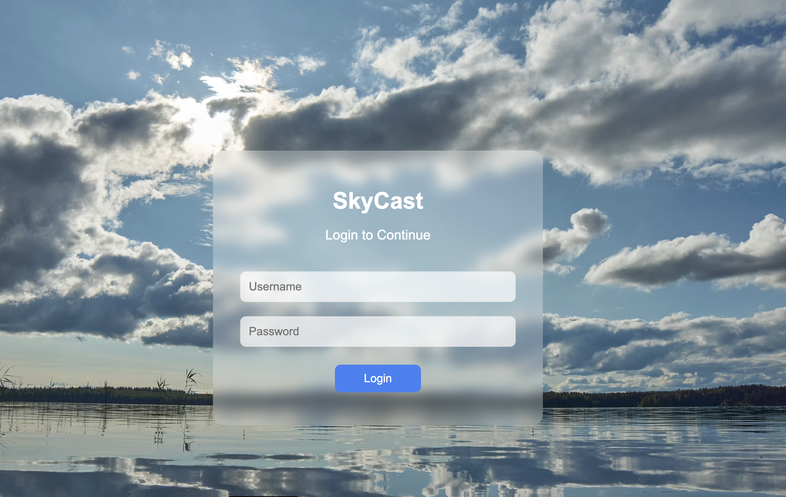
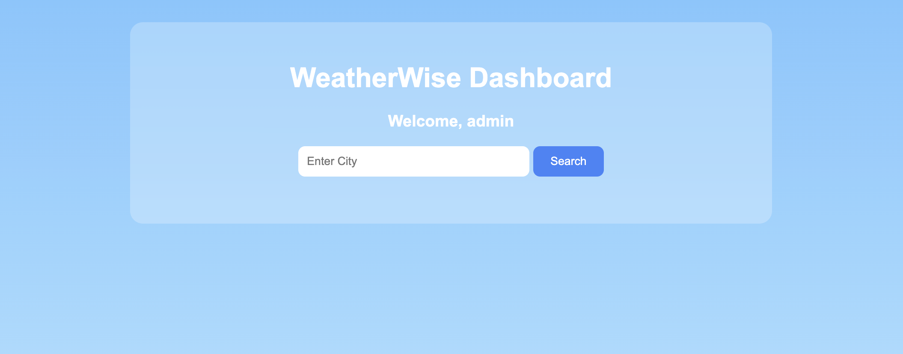
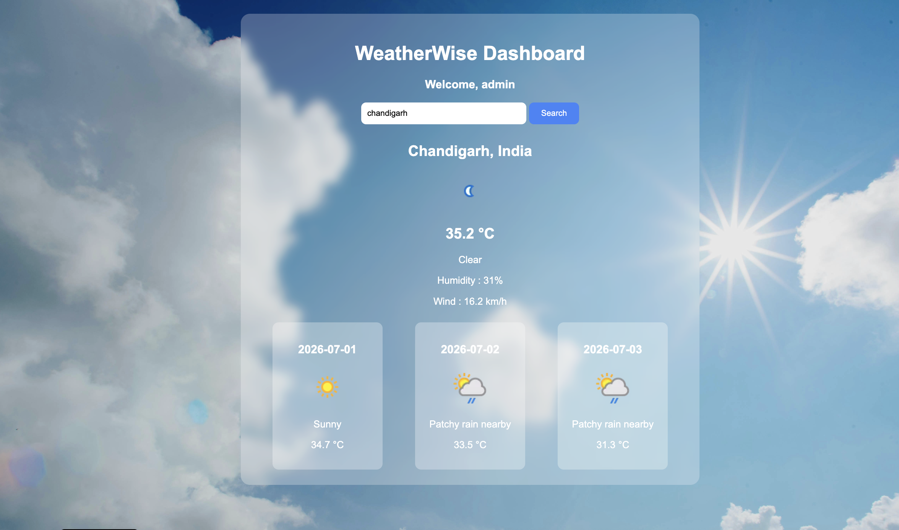
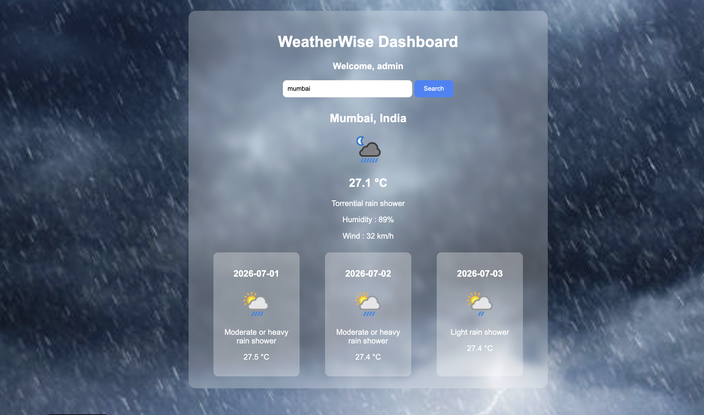

# 🌤WeatherWise

WeatherWise is a simple weather dashboard developed using HTML, CSS, and JavaScript. It allows users to log in using credentials stored in a local JSON file and view the current weather along with a 3-day forecast for any city using the WeatherAPI.

---

## Features

- User Login Authentication
- Credentials fetched from `users.json`
- Search weather by city
- Current weather details
- 3-Day weather forecast
- Dynamic weather information using WeatherAPI
- Simple and responsive user interface

---
# Screenshots

## Login Page



## Dashboard



## Weather Result 1



## Weather Result 2




## Technologies Used

- HTML
- CSS
- JavaScript
- Fetch API
- WeatherAPI
- Git & GitHub

---

## Project Structure

```
WeatherWise/
│
├── index.html
├── dashboard.html
├── users.json
├── README.md
└── images/
```

---

## How to Run

1. Download or clone the repository.
2. Open the project in Visual Studio Code.
3. Run the project using Live Server.
4. Login using one of the credentials from `users.json`.
5. Search for a city to view its weather details.

---

## Login Credentials

| Username | Password |
|----------|----------|
| admin | password123 |
| student | jsbasic2026 |

---

## API Used

WeatherAPI

https://www.weatherapi.com/

---

## Author

Lavanya Luhan

